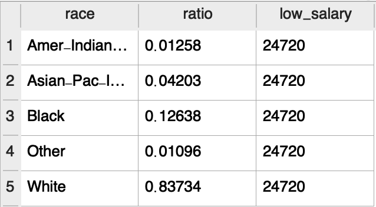
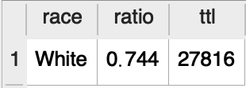
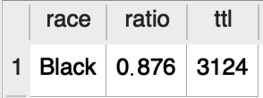
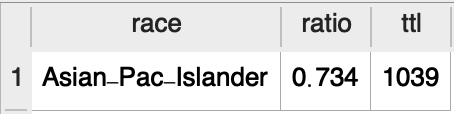
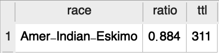

# Adult Data Analysis

> 14 features & 1 categories in total
## `Features`：
* Age 
* Workclass
* Fnlwgt 
* Education
* Education_num
* Marital_status
* Occupation
* Relationship
* Race
* Sex
* Capital_gain
* Capital_loss
* Hours_perweek
* Native_country  
## `Categories`：
* Salary

## `Purpose`:
To see which features are prerequisite for people being paid more than 50k.

##欄位分析:
為什麼選ab
不選c
-不夠均勻

## `Insights`
> ##### Definition
> 50k and above : **High-Earners**
> Less or Equal to 50k : **Low-Earners**

> `1.Age`
(age.sql)

(age_range.sql)

**High-Earners** seems to be around 8 years older than **Low-Earners**. It could be because of older people accumulated more working experience or expertise, they earn more. 
However, from the second chart, we found that people in their 30s earned less than those during 1979-1994. Baby-boomers seemed to enjoy more economic growth.

>`2.Workclass`

(self.employ)
For people who are self-employed, **1/2** of them can earn more than *50k*. On the other hand, only **1/3 - 1/2** of staff in other workclass such local/state governments are high-earners. **Those who are self-employed tend to earn more than others.**

>`3.Education`

From the tables above, people with **Phd degree(doctorate)** are about **4** times more likely than **HS_graduate** to earn more than 50k, not to mention **10th** graders (just 7% of them succeed in marking more money)

>`4.Education Time & Race`

(education_time)
High-Earners receieved **20%** more time than low-paid people did on *education*.

After some sql query, it's obvious that asian people in US spent the most time on taking education.

（source:https://www.ncbi.nlm.nih.gov/pmc/articles/PMC4534330/) Several research indicate that **people with higher education level tend to earn more** than others. And this principle applies to male & female.

As we can see from the table, **Whites** are the **mainstream ethnic group** in US society 1966. And traditionally, white people are considered the ones that have the most resources to have a higher income than other groups. In the following tables, we found that 74.4% of white people are **low-earners**, the ratio is lower than Indians & Blacks. However, **Asian-Pac-Islander** surprisingly has lower rate of being low-earners than whites.
`Some may attribute the acheivement to Asian parents' emphasis of education on their kids.`

>`5.Occuaption`

(occupation_distribution.sql)
* ？問題同上，如何做出組內比例地查詢

>`6.Capital_gain & Capital_loss`

(capital_gain_by_education.sql)
From the table, we can see there is a correaltion between education levle and net capital gain. People with higher education degree tend to gain more on capital income. We can that these people have more access to financial knowledge in school, which can help them perform better in the market. 
**However** people from **preschool and 10th high school** earn more than **doctorate**. Is it because they were luckier or there are some key investment know-how that people cann't from studies in shcool?

>`7. Sex`

(male.sql)

(female.sql)

(sex_distribution.sql)

a) From the above 2 talbes, it's obvious ratio of male earning salary 50k above is 3 times that of female. 
   b) The phenomenon of pay-inequality between male & female has been existed for decades.
   In 1996, male earn **33%** more than their female counterpart. This could resulted from **gender descrimination** in workplaces and female's **lack of education and skill traning** for certain specialized jobs.

>`8.Marital_status`

>`9. Relationship`

