# Adult Data Analysis

> 14 features & 1 categories in total
## `Features`：
* Age 
* Workclass
* Fnlwgt 
* Education
* Education_num
* Marital_status
* Occupation
* Relationship
* Race
* Sex
* Capital_gain
* Capital_loss
* Hours_perweek
* Native_country  
## `Categories`：
* Salary

## `Purpose`:
To see which features are prerequisite for people being paid more than 50k.

## `Columns Analysis`
Among all the 14 features in the dataset, we found 
`age, sex, race, education & occupation` have larger influence on whether one can become a high-earner.However, each of them are correlated. For instance,the whites are more likely to earn more than 50k than Indians and Black. That's not just because of the race inequality but due to the fact that white people emphasize more on education.

Other factors like `capital-gain, relationship or native contry` seems to be independent features and are more affected by the acquired.

## `Insights`
> ##### Definition
> 50k and above : **High-Earners**
> Less or Equal to 50k : **Low-Earners**

>**`1.Age`**

(age.sql)
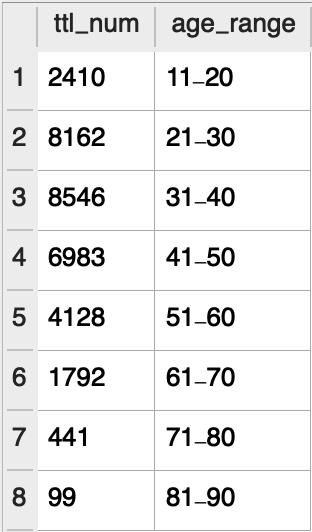
(age_range.sql)

**High-Earners** seems to be around 8 years older than **Low-Earners**. It could be because of older people accumulated more working experience or expertise, they earn more. 
However, from the second chart, we found that people in their 30s earned less than those during 1979-1994. Baby-boomers seemed to enjoy more economic growth.

>**`2.Workclass`**
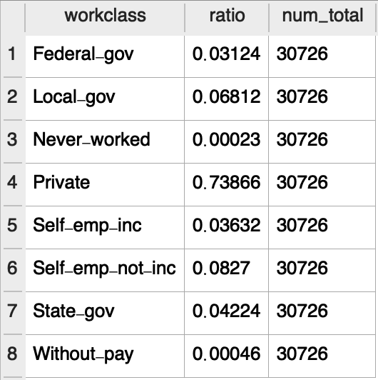

(self.employ)
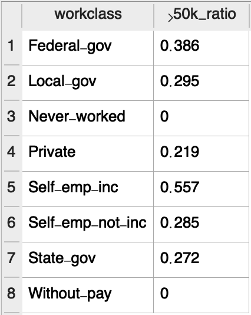
(workclass_50k.sql)
For people who are self-employed, **1/2** of them can earn more than *50k*. On the other hand, only **1/3 - 1/2** of staff in other workclass such local/state governments are high-earners. **Those who are self-employed tend to earn more than others.**

>**`3.Education`**
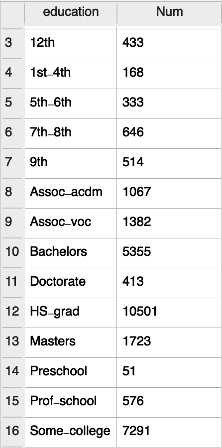(education_distribution.sql)
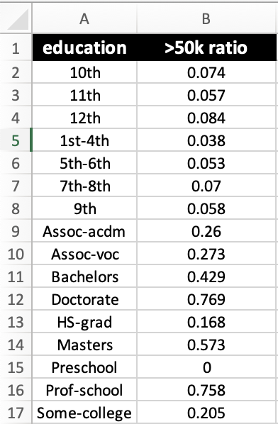(education_50k.sql)
From the tables above, people with **Phd degree(doctorate)** are about **4** times more likely than **HS_graduate** to earn more than 50k, not to mention **10th** graders (just 7% of them succeed in marking more money)

>**`4.Education Time & Race`**

(education_time)
High-Earners receieved **20%** more time than low-paid people did on *education*.
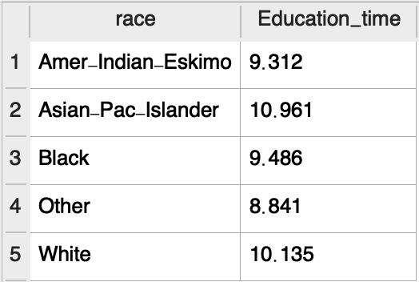
After some sql query, it's obvious that asian people in US spent the most time on taking education.
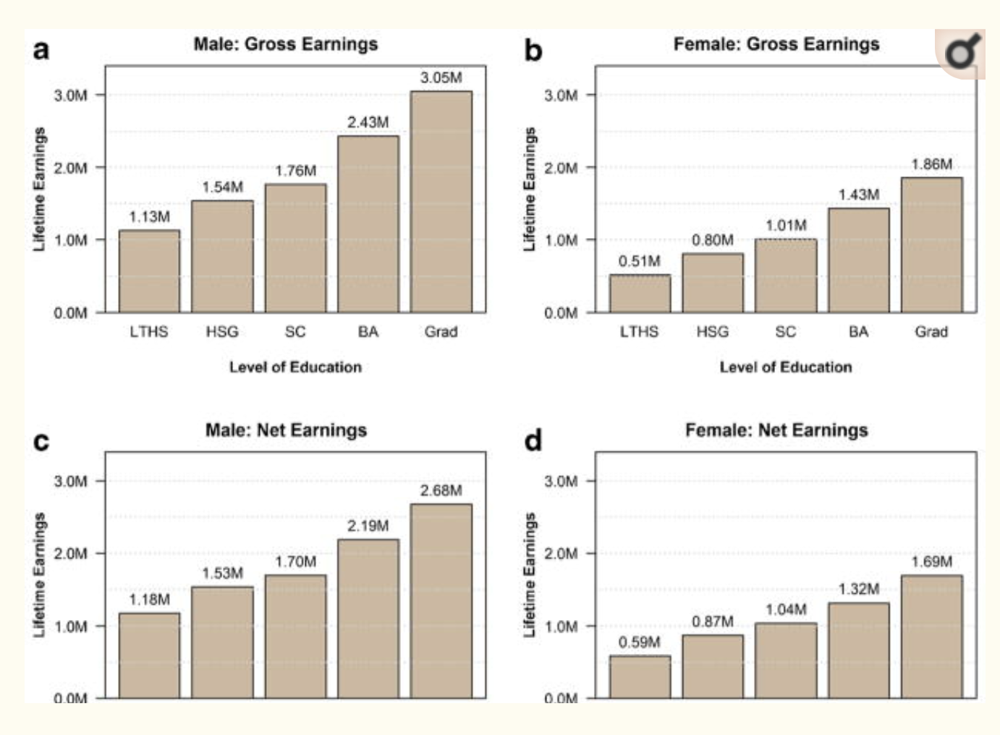
（source:https://www.ncbi.nlm.nih.gov/pmc/articles/PMC4534330/) Several research indicate that **people with higher education level tend to earn more** than others. And this principle applies to male & female.
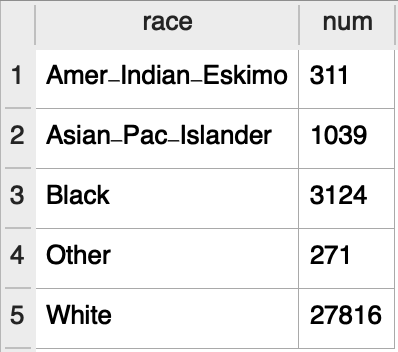
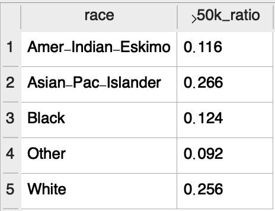
(race_50k.sql)
As we can see from the table, **Whites** are the **mainstream ethnic group** in US society 1966. And traditionally, white people are considered the ones that have the most resources to have a higher income than other groups. In the following tables, we found that 74.4% of white people are **low-earners**, the ratio is lower than Indians & Blacks. However, **Asian-Pac-Islander** surprisingly has lower rate of being low-earners than whites.
`Some may attribute the acheivement to Asian parents' emphasis of education on their kids.`

>`5.Occuaption`
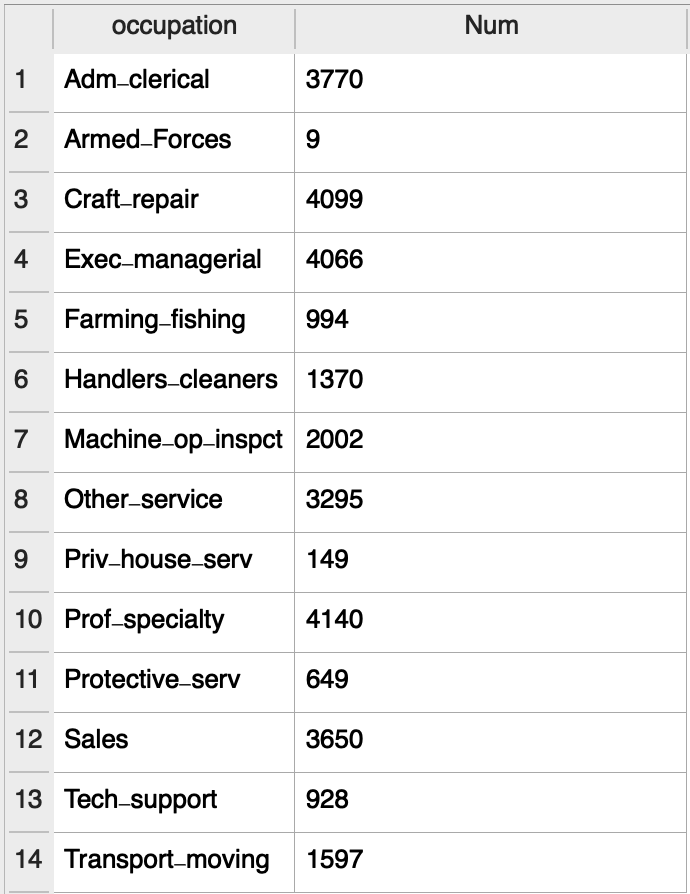
(occupation_distribution.sql)
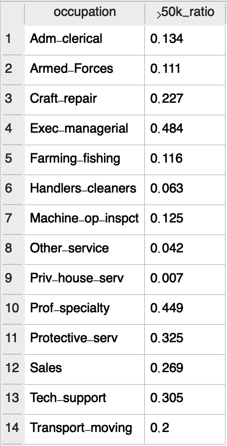
（occupation_50k.sql）
For people in US 1966, people whose occupation is **exec_managerial** & **prof_specialty** have almost 50% chances earning more than 50k. Compared with **private_house_server(0.7%)** & **admin_clerical(13.4%)**, `managers and professors are more educated and possess more specialy, which are their advantages in job market`.

>**`6.Capital_gain & Capital_loss`**
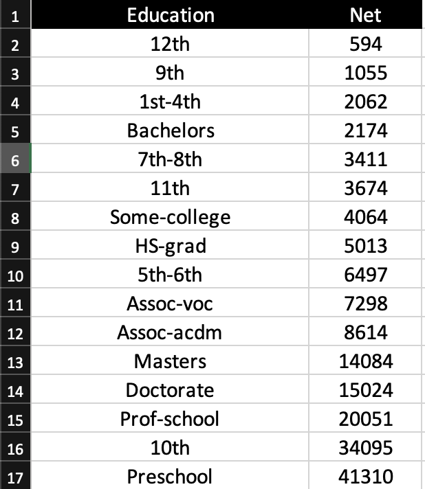
(capital_gain_by_education.sql)
From the table, we can see there is a correaltion between education levle and net capital gain. People with higher education degree tend to gain more on capital income. We can that these people have more access to financial knowledge in school, which can help them perform better in the market. 
**However** people from **preschool and 10th high school** earn more than **doctorate**. Is it because they were luckier or there are some key investment know-how that people cann't from studies in shcool?

>**`7. Sex`**

(male.sql)

(female.sql)
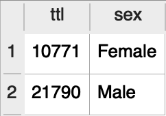
(sex_distribution.sql)

a) From the above 2 talbes, it's obvious ratio of male earning salary 50k above is 3 times that of female. 
   b) The phenomenon of pay-inequality between male & female has been existed for decades.
   In 1996, male earn **33%** more than their female counterpart. This could resulted from **gender descrimination** in workplaces and female's **lack of education and skill traning** for certain specialized jobs.

>**`8.Marital_status`**
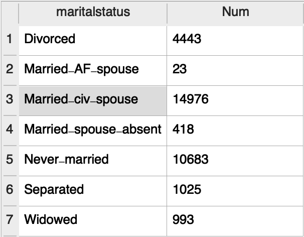
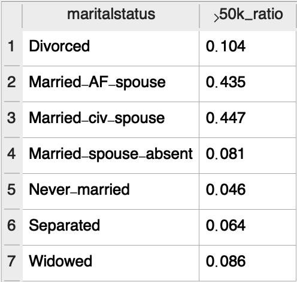
In 1966, `married people(AF/CIV spouse)` are much more likely to be high-earners
Here are a few reasons for tht phenomena:
* Married people could receive family support so that they get focus more on job, in turn marking more money.
* The reason why people were not married then was that they were not financially qualified to get married.

>**`9. Relationship`**
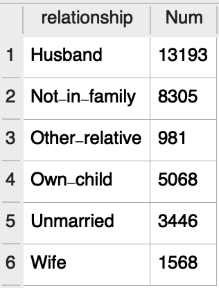
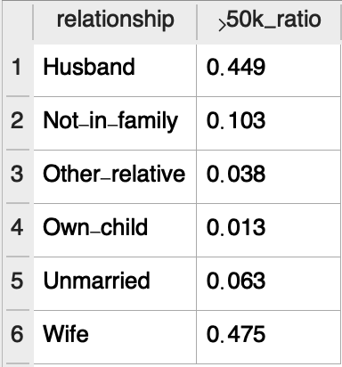(relationship_50k.sql)

>**`10. Hours Per Week`**
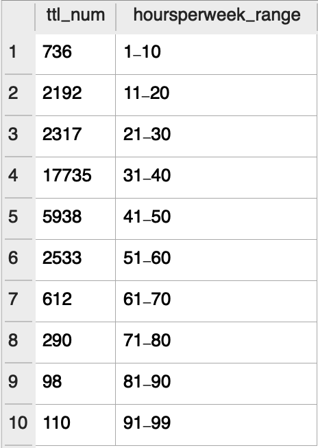

>**`11. Native Country`**
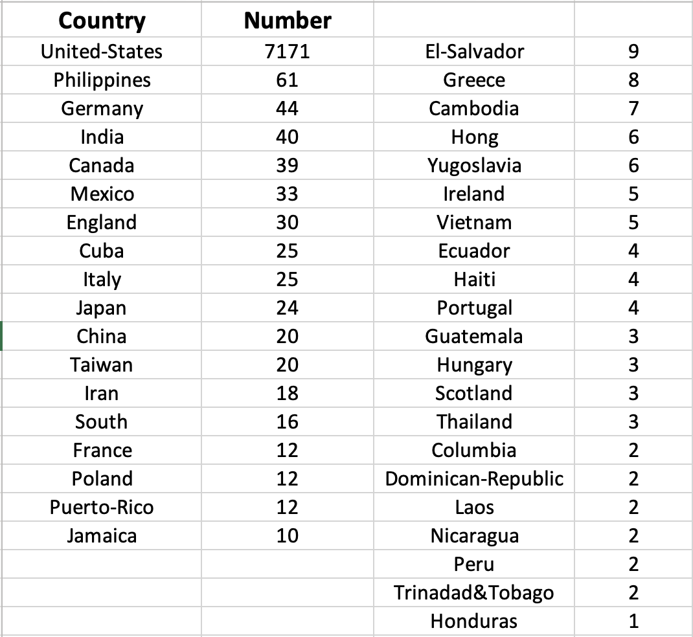
Most of the people 1966 are **US native**. The other population come from all over the world. But most of the immigrants were from `Eruope, America(Canada & Mexico)` and of course **densely-populated** areas like `India, Mainland China, Japan & Taiwan`.
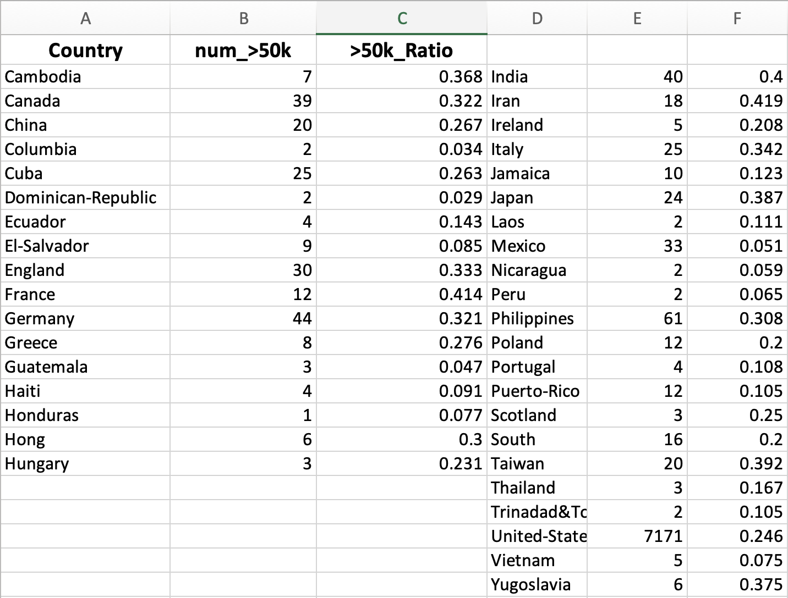
We see higher ratio of high-earners for immigrants from Europe(France, Germany & England). It's believed that these were all **well-developed** counties and some specialists or industry elites moved to US for better career development or next generations's education opportunity. 
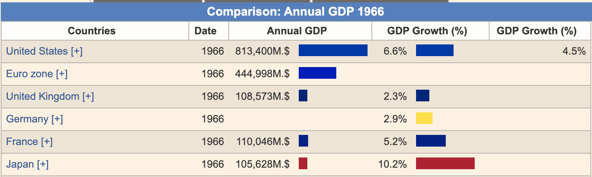
On the other hand, those from Vietnam, Puerto-Rico or Honduras can be seen as `"escaped"` to US to survive as their home coutry suffered from `civil war or dictactoship`.

