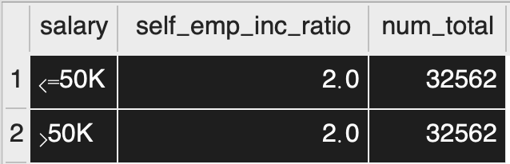
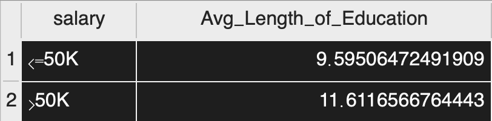
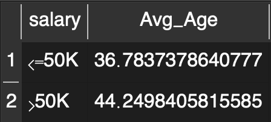
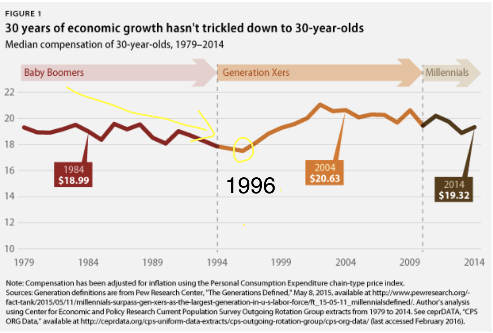
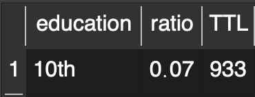

# Adult Data Analysis

> 14 features & 1 categories in total
## `Features`：
* Age 
* Workclass
* Fnlwgt 
* Education
* Education_num
* Marital_status
* Occupation
* Relationship
* Race
* Sex
* Capital_gain
* Capital_loss
* Hours_perweek
* Native_country  
## `Categories`：
* Salary

## `Purpose`:
To see which features are prerequisite for people being paid more than 50k.

## `Insights`
> ##### Definition
> 50k and above : **High-Earners**
> Less or Equal to 50k : **Low-Earners**

1.For people who are self-employed, **1/2** of them can earn more than *50k*. On the other hand, only **1/3 - 1/2** of staff in other workclass such local/state governments are high-earners. **Those who are self-employed tend to earn more than others.**

2. High-Earners receieved **20%** more than low-paid people on *education*.

3. a) From the above 2 talbes, it's obvious ratio of male earning salary 50k above is 3 times that of female. 
   b) The phenomenon of pay-inequality between male & female has been existed for decades.
   In 1996, male earn **33%** more than their female counterpart. This could resulted from **gender descrimination** in workplaces and female's **lack of education and skill traning** for certain specialized jobs.

**High-Earners** seems to be around 8 years older than **Low-Earners**. It could be because of older people accumulated more working experience or expertise, they earn more. 
However, from the second chart, we found that people in their 30s earned less than those during 1979-1994. Baby-boomers seemed to enjoy more economic growth.

>

From the tables above, people with **Phd degree(doctorate)** are about **4** times more likely than **HS_graduate** to earn more than 50k, not to mention **10th** graders (just 7% of them succeed in marking more money)