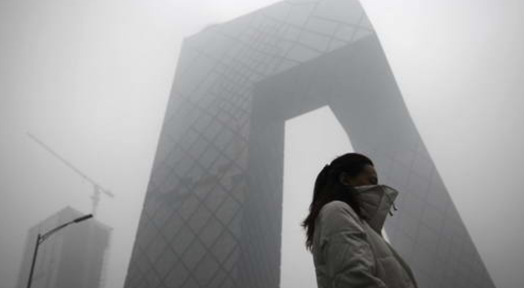

# Air PM2.5 Analysis

> 4 time features & 1 PM2.5(value) 
## `Features`：
* Year 
* Month
* Day  
* Hour
## `Categories`：
* PM2.5

## `Purpose` :
Finding at what time we have the **highest concentration** of pm2.5
## `Insights` :

 
 **(AVERAGE length & width of sepal-petal)**
 1. The `length & width of the sepals` of the three species were captured through sql query, and the differences among the species are not obvious. The judgment is not a feature that can be used to distinguish the species.

 
**(Upper & Lower bound of petal_length of 3 species)**

 2. In the same operation, the difference in petal `length & width between species` is more obvious among groups. For example, the "average length" of petals between species is nearly **3** times different, and the upper and lower bounds of each other's length do not overlap. In this group of data, it is a judgment feature with a fairly high accuracy rate.

