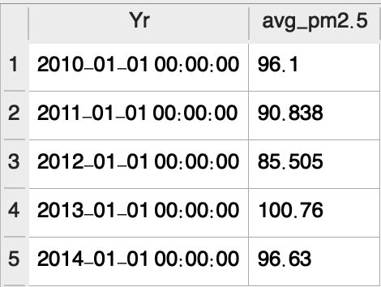

# Air PM2.5 Analysis (Beijing)

> 4 time features & 1 PM2.5 (value) 
## `Features`：
* Year 
* Month
* Day  
* Hour
## `Categories`：
* PM2.5

(*Source: U.S. Environmental Protection Agency*)

## `Purpose` :
Finding at what time we have the **highest concentration** of pm2.5
## `Insights` :
> **`0. Statistics`**
 
(statistics.sql)
On average, concentration of pm2.5 is alomst `100`. During *2010-14*, the air quality in Beijing could be classified `unhealthy` based on US EPA standards.

 > **`1. Monthly Distrubution`**
  
(analysis_bymonth.sql)
From the table, it's obvious every year
from October to March, the concentration of pm2.5 will get higher compared to the rest of time.

 
`Every year, the seasonal wind originating from Mongolia blows the sand & dust all the way to Northern part of China and even Korean Peninsula.`

> **`2. Yearly Distribution`**
 
By group the data by year form 2010-14, We still don't see too much improvement on air quality. The concentration is still too high for human beings.
 
7 years from then, the air pollution issue is still challengin in Beijing.

## `Conclusions:`
According to the analysis above, every year in **`SPRING time (Oct. - Mar.)`**, the concentration of pm2.5 will rise with the `seasonal wind from Gobi, Mongolia` bringing lot of dust.
 

## `Anomaly Detection:`
 
According to NASA's definition, climate events whose value exceed 3-time sigma (called 3-sigma event) can be seen as    **`climate anomaly`**. This kind of event is extremely rare in the past.

> **`1. Dew Point, Air Pressure & Temperature`**
For the 3 features, we used *3-sigma* as the benchmark to detect whether they are anomaly or not. However, there was no any anomaly for these three climate indicators.

> **`2. Wind Speed`**

(speed_boundary.sql)
The range of wind speed varies a lot. The maximum can be `1000` times the minumum speed.

From the table, we can found that for the feature `WIND SPEED`, anomaly happened more frequently than others. The most abnormal phenomena were discovered during the period from `November to January (spring time)`. The period collapsed with the most severe time of sand strom in Beijing.
However, this is not coincidence as WIND SPEED is ond of the **`causes of the storm`**. Some papers have already shown their relationship.

**--> Here! [Correlation Between Wind_speed & PM2.5](https://link.springer.com/content/pdf/10.1007/s13753-011-0008-5.pdf)**

