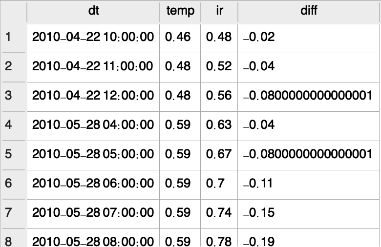
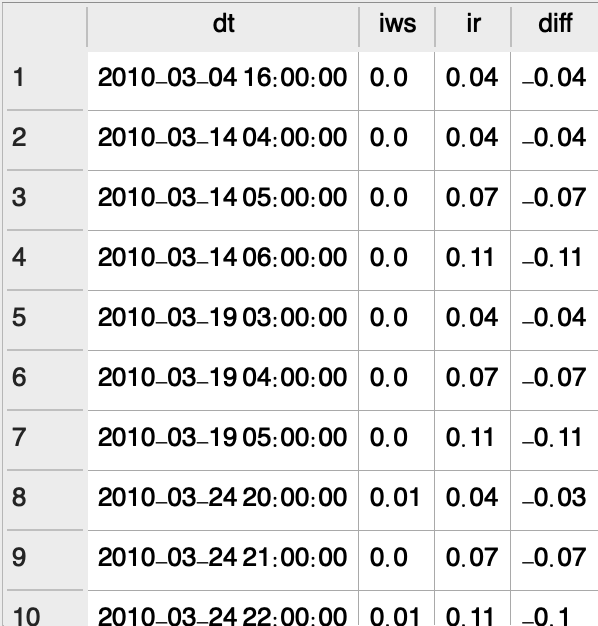
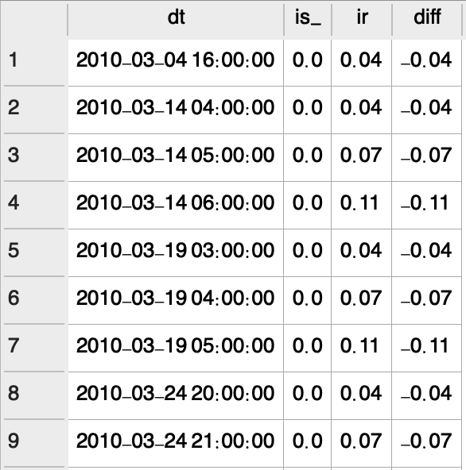

# Air PM2.5 Analysis (Beijing)

> 4 time features & 1 PM2.5 (value) 
## `Features`：
* Year 
* Month
* Day  
* Hour
## `Categories`：
* PM2.5

(*Source: U.S. Environmental Protection Agency*)

## `Purpose` :
Finding at what time we have the **highest concentration** of pm2.5
## `Insights` :
> **`0. Statistics`**
 
(statistics.sql)
On average, concentration of pm2.5 is alomst `100`. During *2010-14*, the air quality in Beijing could be classified `unhealthy` based on US EPA standards.

 > **`1. Monthly Distrubution`**
  
(analysis_bymonth.sql)
From the table, it's obvious every year
from October to March, the concentration of pm2.5 will get higher compared to the rest of time.

 
`Every year, the seasonal wind originating from Mongolia blows the sand & dust all the way to Northern part of China and even Korean Peninsula.`

> **`2. Yearly Distribution`**
 
By group the data by year form 2010-14, We still don't see too much improvement on air quality. The concentration is still too high for human beings.
 
7 years from then, the air pollution issue is still challengin in Beijing.

## `Conclusions:`
According to the analysis above, every year in **`SPRING time (Oct. - Mar.)`**, the concentration of pm2.5 will rise with the `seasonal wind from Gobi, Mongolia` bringing lot of dust.
 
# `Anomaly Detection:`
 
According to NASA's definition, climate events whose value exceed 3-time sigma (called 3-sigma event) can be seen as    **`climate anomaly`**. This kind of event is extremely rare in the past.

## **`Anomaly Analysis of Variable Relevance`**

(stat.sql)

-> The table shows us the `boundary` and `average number` of the **6** variables.

## DEWP VS others:
> **`DEWP vs TEMP`**

(dewp_temp.sql)

> **`DEWP vs PRESSURE`**

(dewp_pressure.sql)

> **`DEWP vs IWS`**

(dewp_iws.sql)

> **`DEWP vs IS`**

(dewp_is.sql)

>**`DEWP vs IR`**

(dewp_ir.sql)

## TEMP VS others:
> **`TEMP vs PRESSURE`**

> **`TEMP vs IWS`**

(temp_iws.sql)

> **`TEMP vs IS`**

(temp_is.sql)

> **`TEMP vs IR`**

(temp_ir.sql)

## IWS VS others:
> **`IWS vs IS`**

(iws_is.sql)

> **`IWS vs IR`**

(iws_ir.sql)

> **`IS vs IR`**

(is_ir.sql)

## **Summary 1**
Above, we try to see if there is any anomalies exist between any 2 different varaible, for example like Dew Point vs Temperature **or** Wind Speed vs Pressure.

## `Single Variable Anomaly Analysis`
> **`1. Dew Point`**

> **`2. Temperature`**

> **`3. Pressure`**

> **`4. Iws`**

> **`5. IS`**

> **`6. IR`**

## **Summary 2**
Here, we set **`3x/4x`** standard deviations as benchmarks to detect anomalies in each variable. Then, we visualize them with scatter charts.

 Then we made a bar chart below to display "**`the number of abonormal days each year`**". 

(3times_var.sql)

