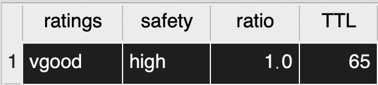
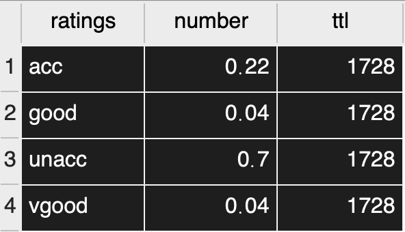
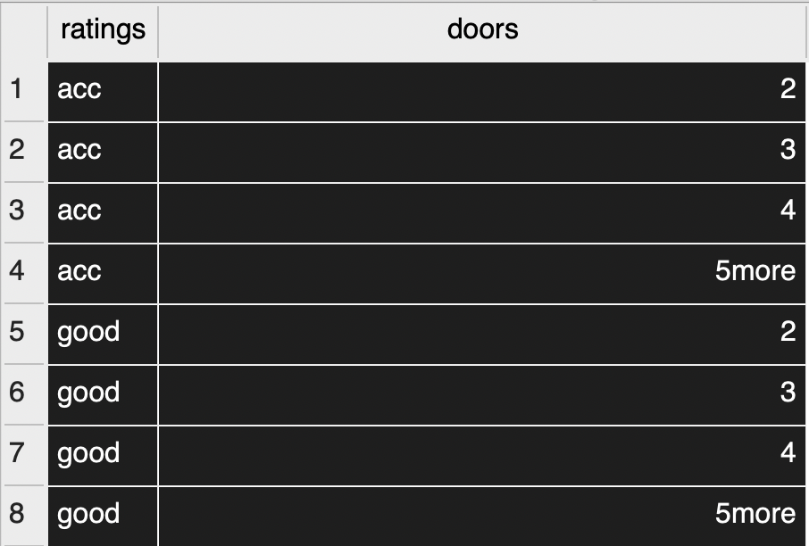
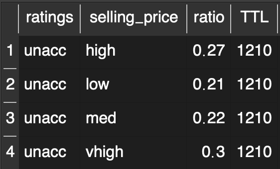

# *Car Data Analysis*
> **6** features & **4** categories in total

## `Features`：
* Selling Price  
* Maintenance Cost  
* Doors  
* Persons
* Lug-boot
* Safety  
## `Categories`：
* Unacc
* Acc
* Good
* Vgood

## `Insights` :
>Here we define：
 a good car as a car with a rating of `vgood or good`
>a bad car : `unacc or acc`

Each of the cars with 'vgood' rating havs high safety. Safety is a powerful feature to classify vgood cars.

Here we can see the distribution across the 4 ratins. Around **70%** of the cars are classified as **unacc**, the worst class of the all.

Clearly, **number_door** is *not* a reliable feature as each of the 4 ratings have doors from **2 - 5more**.

 Most of the goods are charaterized with **low** `selling_price & maintenance_cost`.

>
More than hald of 'unacc' cars come with selling price **med or high**. 

Let's take a lookt at vgood cars' selling_price. All of the are sold at **low or med** price.
-->**Selling_Price** is another useful feature to differentiate among ratings.
-->**Maintenance** is applicable as well.

