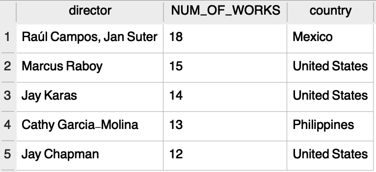
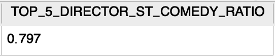
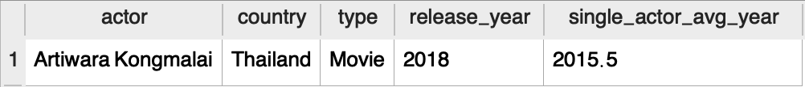
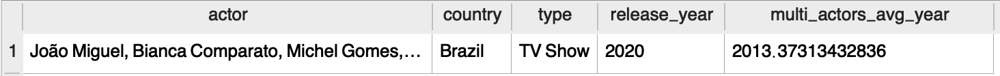
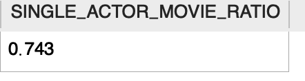

# `Director Analysis`

## `Network analysis of Actors / Directors and find interesting insights`
### **1.1** First,we listed out the 5 directors with the most works:

### **1.2** And we found most of their type of works are "stand-up_comedy"

### **2.1** For those works with just one actor on netflix,the average release_year is `2015`, compared to the others with more than 1 actor (`2013`).

### **2.2** About 74% of those single-actor works are movies. TV series need more actors, because the script content of TV series is more and richer than the details of the movie.For example, a movie can last for two hours, but a short TV series may have more than 20 episodes. Therefore, most TV shows require at least two actors.

### **2.3** Movie/TV Series with just 1 actor have 56% longer title than those works with multiple-actor.

