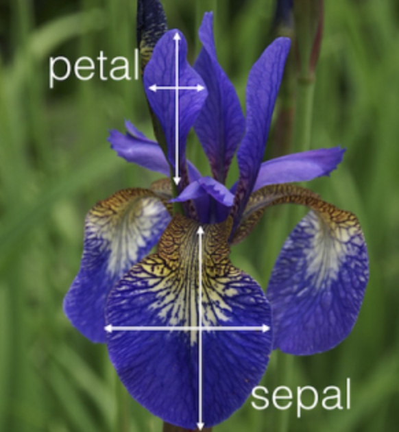
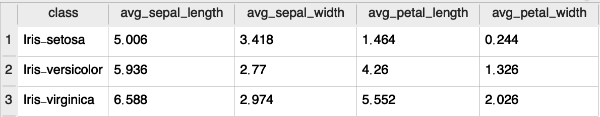
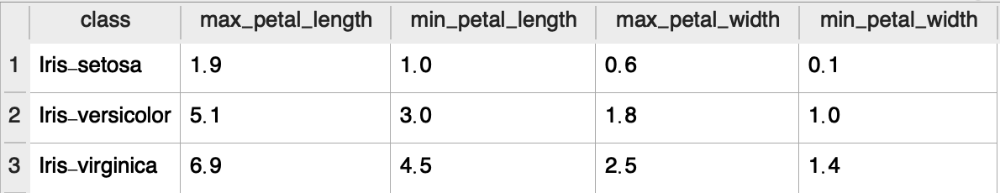

# Iris Data Analysis

> 4 features & 3 categories in total
## `Features`：
* Sepal_length  
* sepal_width  
* petal_length  
* petal_width  
## `Categories`：
* Setosa 
* Versicolor
* Virginica

## `Insights` :

 
 **(AVERAGE length & width of sepal-petal)**
 1. The `length & width of the sepals` of the three species were captured through sql query, and the differences among the species are not obvious. The judgment is not a feature that can be used to distinguish the species.

 
**(Upper & Lower bound of petal_length of 3 species)**

 2. In the same operation, the difference in petal `length & width between species` is more obvious among groups. For example, the "average length" of petals between species is nearly **3** times different, and the upper and lower bounds of each other's length do not overlap. In this group of data, it is a judgment feature with a fairly high accuracy rate.

## `Conclusions` :
In `IRIS dataset`, *length & width of petal* are the two that can be use to classfiy different IRIS species.

